# 一、系统说明

基于springboot+vue+elementui+echarts开发的大学生考勤系统,系统功能齐全, 代码简洁易懂，适合小白学编程。

# 二、系统架构

######      前端：vue| elementui |echarts

######      后端：springboot | mybatis 

######      环境：jdk1.8+ | mysql8.0+ | maven

# 三、代码及数据库

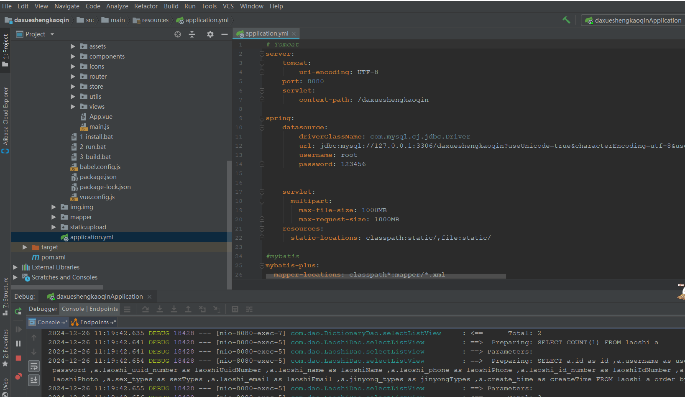

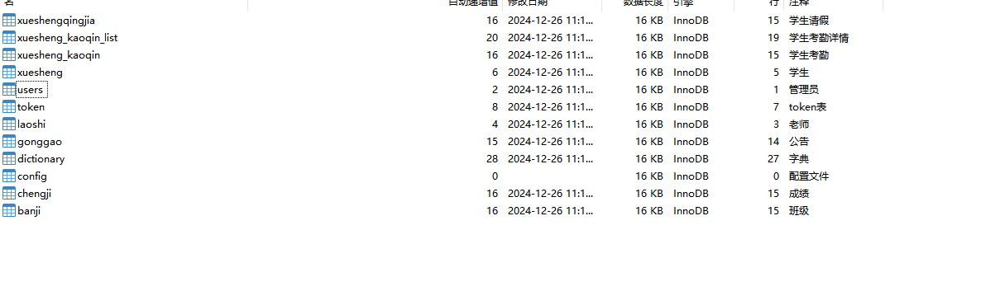

# 四、相关功能介绍

其中角色包含:管理员、老师、学生

#### 1.登录

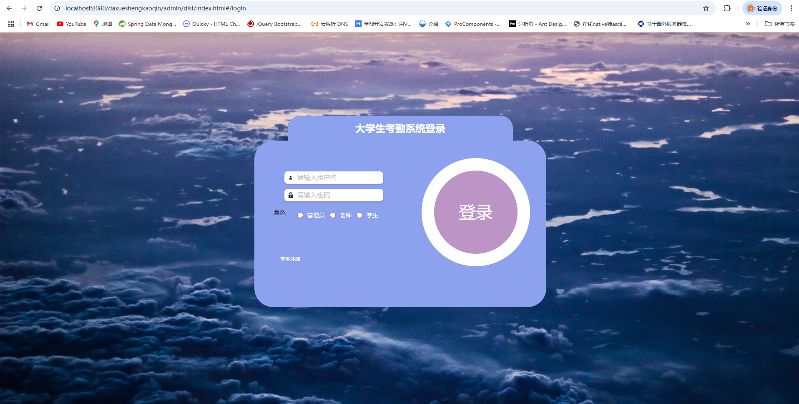

###### 2.学生注册

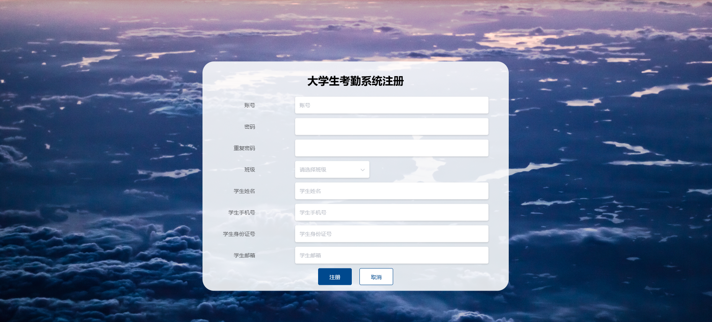

###### 3.个人中心->修改密码

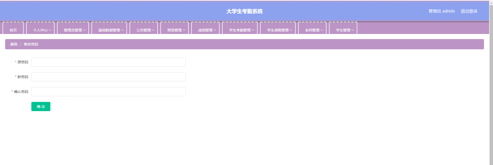

###### 4.管理员信息

包含:详情、删除、修改、查看、新增功能

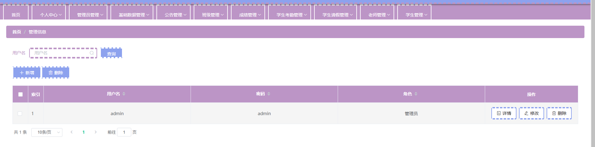

###### 5.基础数据管理->公共类型管理

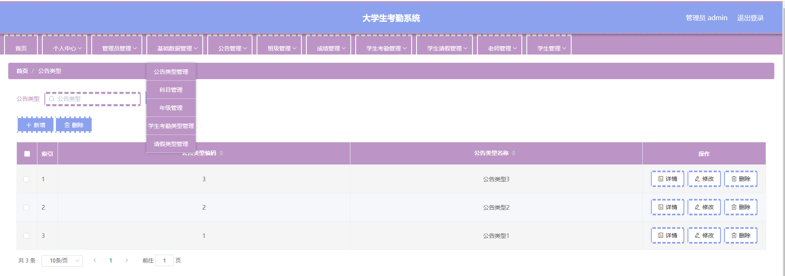

###### 6.基础数据管理->科目类型管理

包含:详情、删除、查询、新增功能

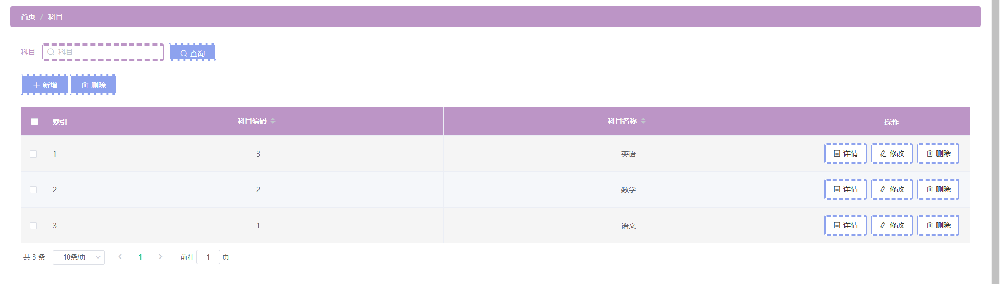

###### 7.基础数据管理->年纪管理

包含:新增、修改、删除、详情功能

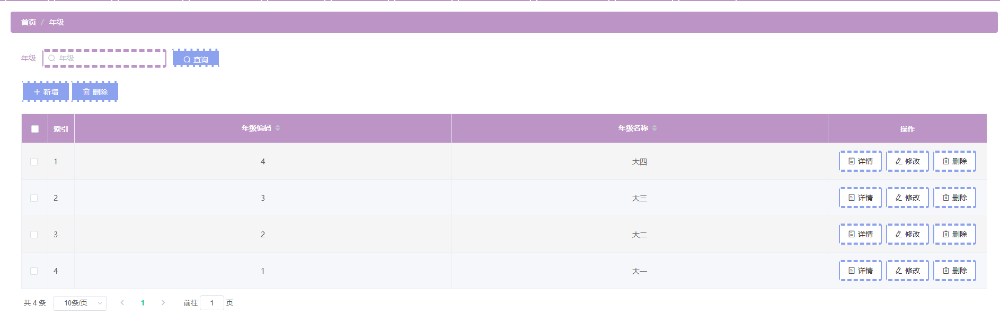

###### 8.公告管理

包含:详情、删除、查询、修改、新增、报表功能

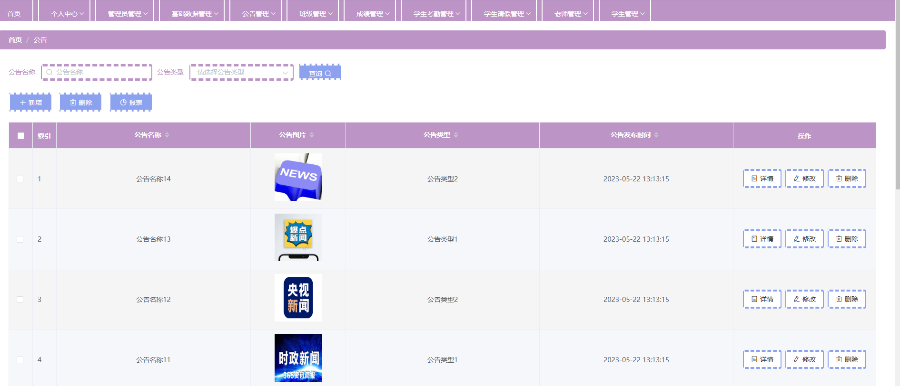

###### 9.班级管理

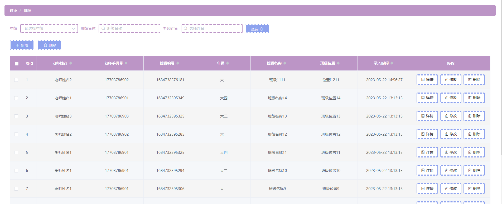

###### 10.成绩管理

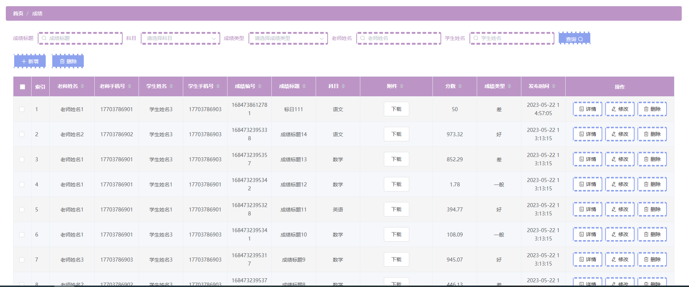

###### 11.学生考勤管理

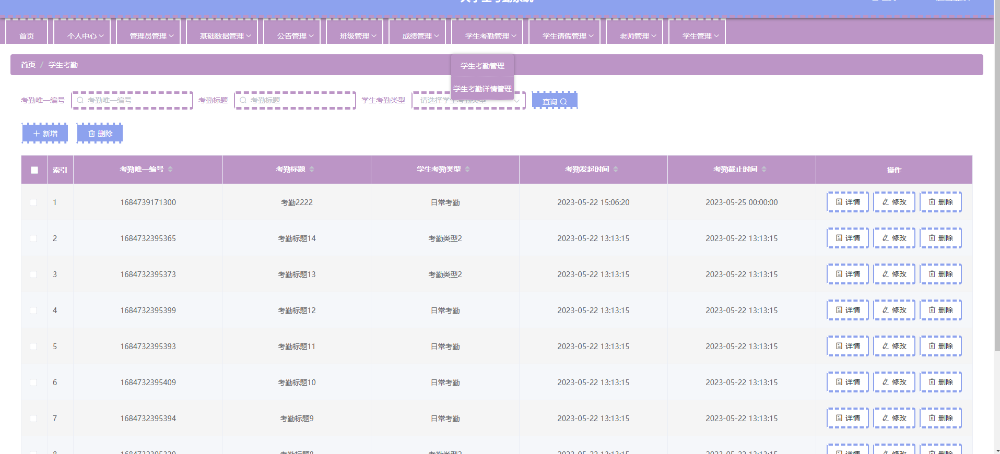

###### 12.学生考勤详情管理

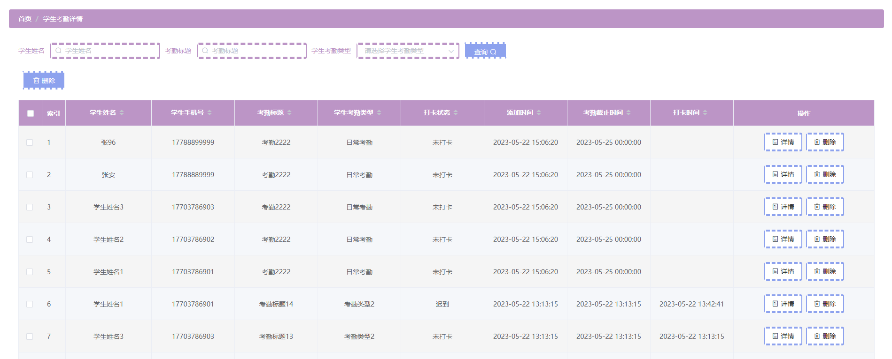

###### 13.学生请假管理

包含:新增、详情、修改、删除、报表功能

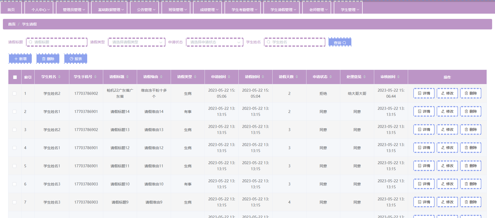

###### 14.老师管理

包含：新增、修改、详情、删除、重置密码功能

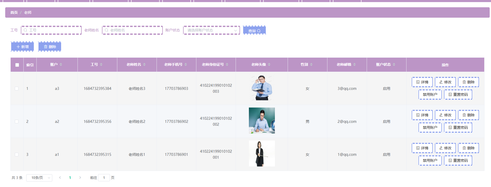

###### 15.学生管理

包含：新增、修改、详情、删除、重置密码功能

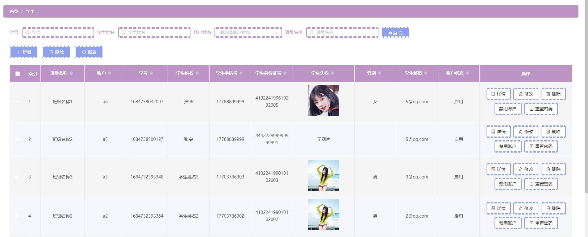

###### 16.老师端登录

注:基本功能与管理员登录差不多，数据权限不一样

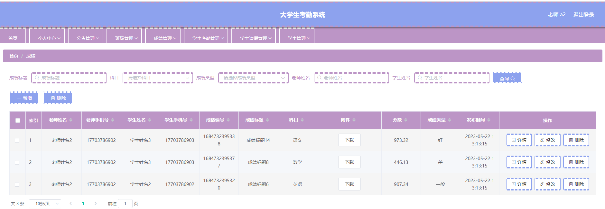

###### 17.学生端登录

注:基本功能与老师端登录差不多、数据权限不一样

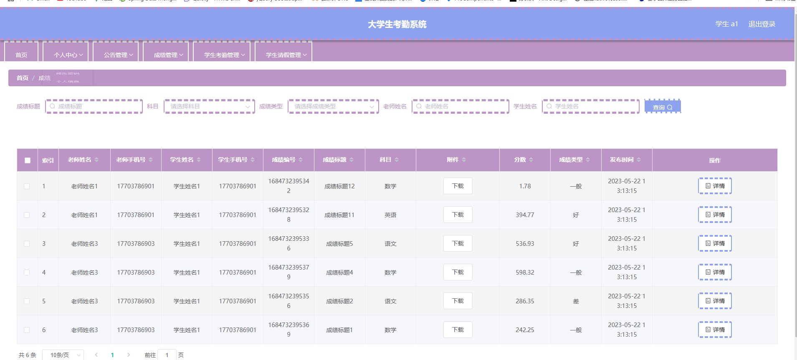

######
